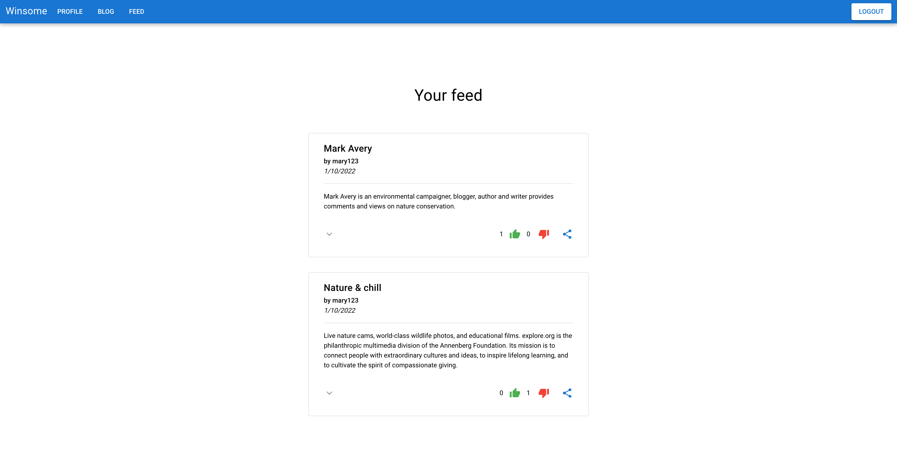

# WINSOME: a reWardINg SOcial Media

## Andrea Simone Costa - 597287

&nbsp;

### Introduzione

Il principio cardine dell'intero progetto, l'obiettivo principale che ha guidato ogni singola scelta durante lo svolgimento della consegna, è stato quello di voler sperimentare diverse tecniche e tecnologie, molteplici approcci per risolvere il medesimo problema, varie soluzioni alternative. Si vorrebbe poter sostenere che il seguire questa filosofia abbia portato a svolgere un buon lavoro, ma in realtà l'unico attributo positivo che l'autore sente di poter accostare con un pizzico di immodestia al prodotto finale è "interessante". La lista delle caratteristiche negative, ahimè, è piuttosto prolissa invece.

Pragmaticamente parlando, l'architettura generale si avvicina a quella di un applicativo web moderno. Il server espone delle - alquanto approssimative - REST API, dialoga utilizzando principalmente il protocollo HTTP, come formato di interscambio per i dati si serve del JSON (JavaScript's SON) e impiega token JWT (JSON Web Token) per l'autenticazione e l'autorizzazione degli utenti. La gestione dei client, a più basso livello, è stata demandata a NIO e alle sue peculiarità basate sul multiplexing dei canali. Salendo di qualche livello di astrazione troviamo JExpress (Java Express, o caffè espresso per gli amici), un "framework" per la costruzione di applicazioni web creato da zero per l'occasione e fortemente ispirato al ben più famoso e meglio riuscito Express.js. La CLI, fornita come prima implementazione di un client come da specifica, è invece piuttosto semplicistica, non particolarmente brillante, specialmente per ragioni di tempo, ma in grado di comunicare perfettamente con il server. È stato progettato e implementato, con alcune limitazioni, anche un altro tipo di client: un applicativo frontend eseguibile su un qualsiasi browser.

Il software è stato scritto, nella sua interezza, adoperando il Java SE Development Kit versione 11. Tra le caratteristiche più recenti del linguaggio utilizzate nella stesura del codice troviamo la dichiarazione di variabili tramite la keyword `var`, piuttosto utile per evitare inutile ridondanza, le lambda e gli stream. In generale è stato preferito un approccio dichiarativo anziché imperativo, con forti influenze da parte della programmazione funzionale che hanno preso forma principalmente favorendo l'Either type, e il suo gemello eterozigote Validation, piuttosto che un utilizzo massiccio delle eccezioni.

&nbsp;

### Concetti base

Si è ritenuto necessario dedicare un piccolo spazio ad una spiegazione veloce, ma essenziale, di alcuni aspetti del progetto che potrebbero risultare non familiari a eventuali lettori.

#### Either<E, A>

L'Either type è spesso utilizzato per modellare, nella programmazione funzionale, una computazione che produce un risultato avente tipo `A` se termina con successo, ma che potrebbe risultare invece in un errore avente tipo `E` in caso di un qualsivoglia problema. Principio cardine del paradigma funzionale è la composizione: dati una entità avente tipo `Either<E, A>` e una funzione `A -> Either<E, B>`, ovvero una funzione che necessita di un parametro di tipo `A`, in caso positivo restituisce un valore di tipo `B`, ma che potrebbe fallire durante la sua esecuzione producendo un valore di tipo `E`, è possibile ottenere un valore di tipo `Either<E, B>`.

L'operazione fondamentale che permette tale composizione si chiama `flatMap` ed essa opera come descritto a breve. Se l'entità `Either<E, A>` risulta contenere un valore di tipo `A` allora esso viene estratto e passato come argomento alla funzione `A -> Either<E, B>`. Se invece l'`Either<E, A>` contiene un errore `E`, la funzione `A -> Either<E, B>` non viene chiamata in causa e si procede direttamente ad interpretare l'`Either<E, A>` come un `Either<E, B>`: l'errore viene propagato, nessuna altra computazione può avere luogo.

Vediamo immediatamente un esempio:

```java
var erequest = HttpRequest.build(HttpConstants.GET)
        .flatMap(req -> req.setRequestTarget("/test/index.html"))
        .flatMap(req -> req.setHTTPVersion(HttpConstants.HTTPV11))
        .flatMap(req -> req.setHeader("User-Agent", "Mozilla/4.0(compatible; MSIE5.01; Windows NT)"))
        .flatMap(req -> req.setHeader("Host", "www.tutorialspoint.com"))
        .flatMap(req -> req.setHeader("Accept-Language", "en-us"))
        .flatMap(req -> req.setHeader("Accept-Encoding", "gzip, deflate"))
        .flatMap(req -> req.setHeader("Connection", "Keep-Alive"));
```

Ci troviamo di fronte alla generazione di una richiesta HTTP, dove l'Either type incontra il builder pattern e una simil fluent api. Il metodo statico `build` restituisce un valore di tipo `Either<String, HttpRequest>`, ovvero una entità che potrebbe essere una istanza di `HttpRequest` oppure un errore sottoforma di stringa. Tramite l'operazione di `flatMap` la richiesta HTTP prende progressivamente forma. Ogni singola operazione potrebbe fallire a causa di argomenti invalidi, e in tal caso la chain verrebbe immediatamente interrotta. In caso di successo, invece, le proprietà della richiesta in costruzione saranno modificate. È importante osservare che il parametro `req` non ha tipo `Either<String, HttpRequest>`, bensì `HttpRequest`, poiché viene estratto nel caso in cui l'operazione precedente si è conclusa positivamente.

Un valore di tipo `Either<E, A>` può essere generato tramite due costruttori: il metodo `Either.left` per gli errori, il metodo `Either.right` per i successi:

```java
public Either<String, HttpRequest> setHeader(String key, String value) {
  if (key != null && value != null) {
    this.headers.put(key, value);
    return Either.right(this);
  } else {
    return Either.left("HTTP request header's key and value cannot be null");
  }
}
```

Nel progetto, per semplicità, è stato scelto l'uso del tipo concreto `String` per il caso di errore. Questa scelta si è purtroppo rivelata inadeguata al crescere delle possibili situazioni di errore, poiché rende piuttosto complicato scegliere dinamicamente una strategia piuttosto che un'altra in fase di gestione dell'errore. Una scelta sicuramente più oculata, in tal senso, sarebbe stata `E = Throwable`.

Per quali motivi dovrebbe essere preferito questo approccio piuttosto che il classico lancio delle eccezioni, con conseguente cattura in altri punti del programma? Innanzitutto notiamo che una signature come `A -> Either<Throwable, B>` ben evidenzia il fatto che la funzione potrebbe fallire, e l'utilizzatore della stessa non può, in linea di principio, ignorare la situazione di errore, pena l'impossibilità di compilare a causa delle rimostranze del type system. Quanto appena affermato ha dei lati in comune con il meccanismo delle checked exception.\
In secondo luogo è da apprezzare il maggior controllo sulla gestione del possibile fallimento: esso viene elevato a valore e può essere quindi memorizzato, restituito da una funzione o dato come argomento ad un'altra, raccolto in strutture più complesse, elaborato da pipeline dedicate e così via.\
Lanciare una eccezione inoltre "distrugge" lo stack fino al gestore dedicato, non è possibile tornare al punto critico per tentare un approccio diverso. La computazione deve essere quindi ripresa dall'inizio, indipendentemente dal suo costo. L'`Either` invece permette di provvedere immediatamente un valore alternativo con cui proseguire la computazione appena fallita.

La modellazione degli errori non è però l'unico scopo per cui esiste l'`Either`, in quanto esso è l'esempio per eccellenza di __sum type__, ovvero una struttura dati contenente un valore che può assumere diversi tipi fissati, e solo uno dei tipi può essere in uso in un dato momento.

#### Validation<E, A>

Il tipo `Validation` ha delle similarità con il tipo `Either`, ma non possiede lo stesso potere dal punto di vista della composizione. Il prezzo si paga in favore di una necessità profondamente diversa per quanto riguarda il caso di errore, ovvero la possibilità di eseguire comunque delle computazioni, possibilmente in parallelo, nonostante alcune possano fallire, in modo da poter raccogliere il numero più elevato di errori possibile. Il nome di questo tipo è emblematico, infatti esso è spesso utilizzato per modellare controlli di validità su strutture aventi dipendenze esterne, come ad esempio istanze derivanti dalla deserializzazione del JSON ottenuto in base all'input inserito da un operatore umano in un form.

Per poter combinare tra loro i possibili errori durante l'esecuzione delle computazioni, poiché essi potrebbero avere un qualunque tipo `E`, purché sia il medesimo tra tutti essi, la strategia più comune consiste nella loro raccolta in una qualche sequenza, come ad esempio una lista o un array, posticipando completamente la loro gestione. Se infatti è piuttosto chiaro come due istanze di `String` possano essere combinate, lo è molto meno nel caso di due `RuntimeException`. In generale spetterà quindi al client della validazione la decisione sul da farsi coi possibili errori incontrati. Questa tecnica ha un nome preciso per gli adetti ai lavori, si tratta di sfruttare il monoide libero su `E`.

#### JWT

Passando dalla teoria alla pratica, vediamo brevemente cosa sono i JSON web token e come possono essere utilizzati al meglio per verificare l'identità di un utente.

La documentazione, raggiungibile seguendo il link [https://jwt.io/introduction](https://jwt.io/introduction), introduce i JWT nel seguente modo:
> JSON Web Token (JWT) is an open standard (RFC 7519) that defines a compact and self-contained way for securely transmitting information between parties as a JSON object. This information can be verified and trusted because it is digitally signed. JWTs can be signed using a secret (with the HMAC algorithm) or a public/private key pair using RSA or ECDSA.

Un JWT è codificato utilizzando il formato __Base64url__ ed solitamente costruito da tre componenti: un header, un  payload e la signature:

```java
xxxxx.yyyyy.zzzzz
```

L'header è un oggetto JSON codificato contenente informazioni sul tipo di token e sull'algoritmo di firma utilizzato. Anche il payload è un oggetto JSON codificato, nel quale, in linea di massima, possiamo inserire tutte le informazioni di cui abbiamo bisogno per riconoscere l'utente. Infine la firma, la quale è funzione sia dell'header che del payload codificati.

La modalità di utilizzo più comune e semplice consiste nella generazione di un JWT da parte del server al login dell'utente. Il token conterrà gli estremi dell'utente nel payload, sarà firmato utilizzando un secret noto solo al server e verrà inviato all'utente che dovrà utilizzarlo in tutte le richieste successive.\
All'atto della ricezione di una richiesta il server controllerà la presenza e la validità del JWT ricevuto, rifiutando categoricamente di procedere in caso uno dei controlli non avesse successo, oppure andando a identificare precisamente l'attore che l'ha generata in caso positivo, grazie alle informazioni contenute nel payload. Il server potrà quindi decidere in quale modalità svolgere le operazioni legate alla richiesta in essere, a seconda ad esempio del ruolo dell'utente.

&nbsp;

### Il Dominio

Esaminiamo nel dettaglio le varie entità che costituiscono il dominio dell'applicazione.

#### Comment

La classe `Comment` rappresenta i commenti che gli utenti possono aggiungere ai vari post del social network. Oltre al testo è presente una timestamp, un riferimento allo username dell'autore del commento stesso e un riferimento all'uuid del post corrispondente.\
È presente una `CommentFactory` che permette di creare in sicurezza tali entità, dove è strettamente necessario, eseguendo le opportune validazioni.

#### Feedback

La classe `Feedback` viene utilizzata ovunque il server ritenga opportuno inserire nella risposta HTTP un body, ovviamente in formato JSON. Un feedback è un wrapper contentente un generico dato:

```ts
{
  res: String, // già in formato JSON
  ok: Boolean
}
```

#### Post

La classe `Post` rappresenta i post del social network. Ogni post possiede un uuid univoco, un titolo, un contenuto, una timestamp e un riferimento all'autore (username). Sono inoltre presenti tre liste: una per contenere delle informazioni minimali sui rewin del post, una per i riferimenti ai commenti propri del post e una per i riferimenti alle reazioni degli utenti, siano esse positive o negative. Tali liste necessitano di essere sincronizzate manualmente durante l'accesso; poiché sono oggetti sono state utilizzate le lock proprie degli oggetti Java. Infine troviamo un counter che tiene conto del numero di iterazioni già eseguite sul post durante il calcolo delle ricompense, e un flag booleano utile per impedire rewin impropri su un post che è stato appena eliminato.

Lo scopo principale di tale struttura è quello di permettere a più thread aventi compiti diversi di interagire in modo concorrente con la medesima istanza di `Post`. Un thread può quindi aggiungere un commento, mentre un altro thread aggiunge una reazione e un altro ancora aggiunge un rewin. Le uniche due operazioni che devono avvenire obbligatoriamente in mutua esclusione sono l'eliminazione di un post e il rewin dello stesso, altrimenti alcune possibili successioni di avvenimenti potrebbero portare alla non eliminazione dei rewin di un post.\
Per quanto riguarda la lettura di tali strutture condivise, viene sempre effettuata una copia in mutua esclusione della lista oggetto dell'operazione. Questo diminuisce ulteriormente la serializzazione delle attività eseguite dai vari thread, anche se ciò potrebbe inficiare la consistenza della lettura in sé in quanto il dato ottenuto potrebbe non corrispondere allo stato ultimo.\
Abbiamo a che fare con quella che viene definita __eventual consistency__, nella quale le operazioni di lettura e scrittura hanno disponibilità massima, non è detto che una lettura ottenga lo stato conseguente all'ultima scrittura, ma sicuramente se non vi sono nuovi aggiornamenti ad un dato alla fine tutti gli accessi ad esso restituiranno l'ultimo valore aggiornato.

Per concludere questa sezione dedicata ai post si evidenzia il fatto che i rewin di un post sono stati considerati come istanze quasi completamente separate dal post originale. Viene effettuata una copia del titolo e del contenuto, ma non delle reazioni né dei commenti, che non sono mai condivisi. Ad ogni modo, l'eliminazione di un post ha come conseguenza l'eliminazione ricorsiva di ogni suo rewin.

Infine, è presente una `PostFactory` per la creazione sicura basata su validazioni, dove necessario, di istanze di tipo `Post`.

#### AuthorPostUuid

Tale classe è un semplice POJO che rappresenta una coppia autore, uuid di un post. È utilizzata principalmente per tenere traccia dei rewin di un post.

#### Reaction

La classe `Reaction` rappresenta le reazioni che gli utenti hanno sui post del social network. Oltre al un flag che indica se la reazione è positiva o negativa, è presente anche una timestamp, un riferimento allo username di chi ha lasciato la reazione e un riferimento all'uuid del post corrispondente.\
È presente una `ReactionFactory` che permette di creare in sicurezza tali entità, dove è strettamente necessario, eseguendo le opportune validazioni.

#### User

La classe `User` rappresenta gli utenti del social network. Ogni utente possiede uno username, una password (hashed) per eseguire l'accesso al network, una lista di tag, due set per contenere utenti seguiti e utenti che seguono, i quali necessitano di sincronizzazione manuale per l'accesso, e infine una hashmap concorrente per i post che mantiene l'associazione `uuid -> post`.

I medesimi ragionamenti che hanno influito sulle scelte prese nella classe `Post` sono presenti nella classe `User`. Ad esempio, un thread può rimuovere un follower mentre altri thread eseguono diverse operazioni su diversi post, specialmente grazie alle proprietà del tipo di hashmap scelta. Anche le conseguenze, dal punto di vista della consistenza, sono condivise con quelle della classe `Post`.

Si osservi la presenza del metodo `synchronizedActionOnFollowers`, il quale accetta una callback per operare in sola lettura e in mutua esclusione sui follower di un utente. Esso si rivela molto utile per recuperare in fase di login di un utente la lista degli utenti che attualmente lo seguono.

Infine, è presente una `UserFactory` per la creazione sicura basata su validazioni, dove necessario, di istanze di tipo `User`.

#### UserTags

Tale classe è un semplice POJO che rappresenta una coppia utente, tags dell'utente. È utilizzata principalmente per restituire ai client la lista di followers/following con i relativi tag.

#### Wallet

La classe `Wallet` contiene lo stato dei portafogli di ogni singolo utente. Possiede internamente una hashmap concorrente che associa ad ogni utente il proprio portafoglio, ovvero una lista di transazioni. La hashmap è concorrente poiché più thread potrebbero aver necessità di eseguire azioni sul portafoglio di utenti diversi, azioni che non hanno motivo di essere serializzate.\
La situazione che necessita di un occhio di riguardo è l'aggiunta di una nuova transazione, da sincronizzare con l'accesso in lettura alla lista di transazioni dell'utente oggetto di interesse.

Valgono le considerazioni sulla eventual consistence fatte in precedenza per altre classi.

#### WalletTransaction

La classe è un semplice POJO che rappresenta una coppia guadagno, timestamp, e concorre a formare la history del portafoglio di un utente.\ È presente una `WalletTransactionFactory` per la creazione sicura basata su validazioni, dove necessario, di istanze di tipo `WalletTransaction`.

&nbsp;

### Protocollo HTTP: richieste e risposte

Il protocollo HTTP è un protocollo a livello applicativo usato principalmente come mezzo di interscambio di informazioni nel web, ed particolarmente adatto per le architetture client-server.

#### HttpRequest

Questa classe espone tutto il necessario per generare una richiesta HTTP base. Dispone di vari metodi, statici e non, che permettono, tra le altre cose, di costruirne progressivamente una, impostando ad esempio il target, gli header e il body, oppure di effettuare il parsing di una stringa contenente una richiesta HTTP valida. Anche l'operazione inversa è supportata: la serializzazione di una istanza `HttpRequest` produce una richiesta HTTP compliant.

#### HttpResponse

Questa classe, duale della precedente, espone tutto il necessario per generare una semplice risposta HTTP. Anche essa permette la costruzione progressiva, supporta parsing e serializzazione ed espone vari metodi statici per velocizzare la creazione di determinate istanze.

#### HttpConstants

La classe `HttpConstants` non è istanziabile e ha come unico scopo quello di centralizzare, sotto un namespace comune, le principali costanti che fanno parte del protocollo HTTP, come ad esempio i metodi, i codici di risposta con le corrispondenti reason e i MIME type più comuni.

#### Content-Length header

È doveroso dedicare un paragrafo, e quale sezione migliore per farlo, ad un problema semplice da porre ma leggermente complicato da affrontare: come può il server (client) determinare, in fase di ricezione di una richiesta (risposta) HTTP, la dimensione dell'eventuale body? Lo standard HTTP delinea tutta una serie di indicazioni, delle quali solo una, in particolar modo, è stata riadattata e implementata nel progetto:
> HTTP/1.1 requests containing a message-body must include a valid Content-Length header field unless the server is known to be HTTP/1.1 compliant. If a request contains a message-body and a Content-Length is not given, the server should respond with 400 (bad request) if it cannot determine the length of the message, or with 411 (length required) if it wishes to insist on receiving a valid Content-Length.

Il server richiede quindi che tutte le richieste HTTP che non siano GET/DELETE/OPTIONS contengano l'header __Content-Length__, in modo tale da poter conoscere esattamente il numero di byte da leggere dopo la sequenza __CR LF CR LF__ segnalante la fine della sezione dedicata agli header. In caso contrario, il server si rifiuta di gestire la richiesta e termina unilateralmente la connessione con il client. Da parte sua, il server imposta sempre tale header in ogni risposta che trasmette al client, in quanto anche esso necessita di sapere la dimensione del body della risposta ricevuta.

&nbsp;

### JExpress

Ogni server che espone una interfaccia REST necessita di poter definire delle rotte, eventualmente parametriche, associando ad ogni rotta un handler dedicato per la gestione delle richieste HTTP ad essa indirizzate. JExpress raggiunge questo obiettivo permettendo una registrazione agile ed effettiva degli handler da associare alle varie rotte, oltre a consentire la schedulazione di più middleware che agiscono prima dell'handler dedicato, feature essenziale per la gestione dell'autenticazione dell'utente. Non è invece possibile registrare più di un handler per ogni singola rotta.

Vediamo un esempio, nel quale viene impostato un handler per la gestione della rotta parametrica `/users/:user_id` sul metodo POST:

```java
jexpress.post("/users/:user_id", (request, params, reply) -> {

  assertTrue(request instanceof HttpRequest);

  assertTrue(params.containsKey("user_id"));

  var response = HttpResponse.build(HttpConstants.HTTPV11, HttpConstants.OK_200[0], HttpConstants.OK_200[1])
      .flatMap(req -> req.setHeader("Server", "nginx/0.8.54"))
      .flatMap(req -> req.setHeader("Date", "02 Jan 2012 02:33:17 GMT"))
      .flatMap(req -> req.setHeader("Content-Type", "text/html"))
      .flatMap(req -> req.setHeader("Connection", "Keep-Alive"))
      .flatMap(req -> req
          .setBody("<!DOCTYPE html><html><body><h1>User " + params.get("user_id") + "</h1></body></html>"));

  reply.accept(response);

});
```

L'handler prende in ingresso tre parametri:

1. `request`, l'istanza della classe `HttpRequest` che descrive la richiesta HTTP
2. `params`, una istanza di `Map<String, String>` che associa ad ogni parametro della rotta il valore attuale
3. `reply`, una istanza di `Consumer<Either<String, HttpResponse>>` ovvero una callback che l'handler dovrà invocare fornendo o la `HttpResponse` da inoltrare al client o una stringa di errore, che verrà automaticamente trasformata in una 500 - Internal Server Error dal framework.

Un middleware viene registrato utilizzando il metodo `use`:

```java
jexpress.use((request, params, reply, next) -> {

  request.context = XYZ.parse(request.getBody());

  next.run();
});
```

I middleware sono globali, ovvero entrano in gioco indipendentemente dal metodo della richiesta HTTP da trattare e prima dell'unico route handler dedicato a ciascuna rotta.\
Nell'esempio sopra notiamo alcuni aspetti principali. Innanzitutto ogni middleware deve esplicitamente dare il via libera all'esecuzione del successivo, o del route handler, invocando la callback `next`; questo permette a middleware aventi particolari responsabilità di bloccare la successiva parte dell processo gestione della richiesta, avvalendosi anche della possibilità di rispondere immediatamente al client tramite la callback `reply`. Inoltre, ogni richiesta ha un field generico `context`, il quale può essere utilizzato da un middleware per memorizzare dati, come ad esempio un oggetto deserializzato, rendendolo disponibile ai middleware successivi e all'handler dedicato alla rotta.

Possiamo ritenere l'istanza di `JExpress` thread safe, a patto di tenere separate la fase di configurazione dei middleware e degli handler da quella di utilizzo per la gestione delle richieste tramite il metodo `handle`:

```java
Either<String, HttpResponse> eresponse = jexpress.handle(justAnHTTPRequest);
```

Internamente, infatti, il framework non fa uso di né di strutture concorrenti né di blocchi `synchronized` né di lock di alcun tipo, in modo tale garantire la massima reattività. Durante la fase di gestione delle richieste tali strutture dati vengono sempre utilizzante in sola lettura; è solo nella fase di configurazione che si presenta la necessità di eseguire operazioni di scrittura.

In conclusione di questa sezione è doveroso ringraziare tale Mark McGuill che, ormai quasi 6 anni fa, ha eseguito il porting da JavaScript a Java di una utility fondamentale per l'esistenza di JExpress. La trasformazione da rotta parametrica, sottoforma di stringa, a regexp in grado di eseguire il matching sui target delle richieste HTTP, e di estrarre eventuali parametri, è possibile grazie al suo prezioso contributo alla comunità opensource, liberamente fruibile al seguente indirizzo: [https://github.com/mmcguill/express-routing](https://github.com/mmcguill/express-routing).

&nbsp;

### Utils

Questa sezione raccoglie varie classi e metodi di utilizzo generale.

#### Hasher

Tale classe espone un metodo statico, `hash`, che esegue l'hasing di una stringa utilizzando l'algoritmo SHA-512.

#### JWTUtils

Tale classe espone dei metodi per creare, validare e decodificare i token JWT.

#### Pair

Una generica coppia di oggetti eterogenea.

#### Triple

Una generica tripla di oggetti eterogenea.

#### TriConsumer

Una `FunctionalInterface` rappresentante il tipo delle funzioni con tre parametri in ingresso, eventualmente di tre tipi diversi, che restituiscono `void`.

#### QuadriConsumer

Una `FunctionalInterface` rappresentante il tipo delle funzioni con quattro parametri in ingresso, eventualmente di quattro tipi diversi, che restituiscono `void`.

#### ToJSON

Una classe che provvede metodi statici utili per la conversione in JSON di alcuni tipi primitivi.

#### Wrapper

Un banale wrapper che racchiude un qualsiasi tipo di dato. La sua utilità principale è quella di permettere di bypassare alcune semplici limitazioni del linguaggio.

&nbsp;

### Winsome

La classe winsome è il cuore pulsante dell'intero progetto, poiché contiene tutto il necessario per il controllo pratico del social network.

La struttura dati principale è una `ConcurrentMap<String, User>` contenente l'associazione `username -> User`. Essa è il social network, poiché contiene ogni utente registrato. Una volta ottenuto il riferimento ad un utente è possibile accedere direttamente ad ogni suo post in quanto, ricordiamo, i post sono direttamente referenziati nella classe `User`.\
Troviamo inoltre una `ConcurrentMap<String, String>` contenente l'associazione `username -> JWT`, ad indicare quali utenti sono "loggati" e quale è il token JWT corrispondente. Per velocizzare l'accesso ad un post, dato il suo id, è risultata sufficiente una sola `ConcurrentMap<String, String>` ridondante, la quale contiene l'associazione `post uuid -> username autore`. Infine è presente una reference al `wallet` contenente il portafogli di ogni utente.\
Si osservi anche la possibilità di impostare una callback che verrà invocata ogniqualvolta il set di followers di un utente viene modificato.

Per quanto riguarda la gestione della concorrenza, si fa perno sulle proprietà concorrenti delle hashmap elencate sopra ogni volta che è possibile, tenendo anche in considerazione un'invariante importante: nessun utente registrato può disiscriversi dal social network. In altre occasioni si è reso necessario un controllo più fine, principalmente nel caso in cui ci si è trovati a dover apportare modifiche ai set dei followers/following di un utente, o nel caso in cui un post debba essere eliminato e/o "rewinnato". In generale, si punta a serializzare il meno possibile le varie operazioni, sebbene ciò, nuovamente, porti inevitabilmente a scontrarsi con l'eventual consistency.

Una precisazione importante. In varie parti del codice sono presenti istruzioni, improntate alla lettura dei dati, come `aConcurrentMap.entrySet().stream()` oppure `aListOrASet.stream()`, ed è inevitabile chiedersi se tali operazioni sono safe da un punto di vista della concorrenza.\
Per quanto riguarda il primo caso la risposta è sempre affermativa, in quanto l'iterazione sull'entry set di una struttura concorrente è priva del rischio di incorrere nella spiacevole `ConcurrentModificationException`, al prezzo del rischio di non incontrare eventuali elementi aggiunti alla struttura dopo l'inizio dell'iterazione.\
Nel caso di strutture non concorrenti, la questione è leggermente più delicata. Ottenere uno stream, come già accennato, è una operazione che ha molto in comune con il processo di iterazione messo a disposizione dal linguaggio. Se tale struttura venisse modificata durante l'uso dello stream, si potrebbero incontrare spiacevoli conseguenze. Ecco perché la strategia adottata, specialmente evidente nelle classi `User` e `Post`, è quella di restituire una shallow copy della struttura dati creata in mutua esclusione. Tale copia non rifletterà eventuali modifiche apportate alla struttura dati originale, ma potrà essere iterata in totale sicurezza.

Per quanto riguarda i dati contenuti all'interno di tali strutture, varie sono le situazioni nelle quali si può incorrere. L'accesso concorrente a dati che sappiamo essere di sola lettura può avvenire senza alcun tipo di problema, mentre in altri casi si è reso necessario acquisire delle lock più granulari. Fuori dalla classe Winsome l'operazione principale che viene effettuata su tali contenuti è la trasformazione in formato JSON; tale trasformazione si basa su dei metodi esposti dalle classi in gioco che si preoccupano di acquisire le lock necessarie.

A occuparsi della persistenza dei dati e dell'aggiornamento dei portafogli sono due metodi in particolare, `makePersistenceRunnable` e `makeWalletRunnable`, i quali permettodo di configurare e restituiscono dei `Runnable` che si occuperanno, rispettivamente, della persistenza e dei portafogli. Per semplicità i dati dell'intero social, portafogli compresi, vengono periodicamente memorizzati in un unico file, il cui path è configurabile nelle impostazioni del server, in formato JSON. Tali `Runnable` saranno eseguiti in thread dedicati dal server, unico utilizzatore della classe `Winsome`.

&nbsp;

### Il Server

Esaminiamo più nel dettaglio componenti che contribuiscono al funzionamento del server.

#### Server

Come già anticipato, le richieste dei client e le relative risposte da inoltrare vengono gestite, a basso livello, utilizzando NIO e il multiplexing dei canali, per quando riguarda le feature richieste usufruibili tramite socket TCP. La classe `Server` ha principalmente tale compito, facendosi onere nella pratica della maggior parte delle comunicazioni da e verso i client.

Per affrontare la gestione del parsing dell'header `Content-Length` è stato necessario introdurre delle strategie un pelo sofisticate in alcune occasioni. Dato che in entrata si ha un flusso di byte, suddiviso in chunk dal contenuto non determinato, tale header potrebbe comparire in qualunque momento. Si è fatto perno sull'individuare sequenza CR LF CR LF per permettere un parsing parziale della richiesta HTTP, in particolare degli header impostati, in modo tale da poter proseguire col ricevere la sua restante parte.

Osserviamo che vi è un solo `ByteBuffer`, condiviso tra tutti i client, adibito alla lettura dei byte dai canali, il quale contenuto viene immediatamente trasferito in una struttura dati propria di ogni singolo client: una istanza della classe `RequestContext`. NIO gestisce le nuove connessioni in entrata, la lettura della richiesta e la scrittura della risposta in un solo thread; effettuato il parsing completo di una richiesta HTTP, essa viene data in gestione a `JExpress` che eseguirà le proprie operazioni in un thread pool dedicato, per poi restituire a NIO la risposta da inoltrare al client tramite una `CompletableFuture`. Il thread pool, definito _common pool instance_, viene inizializzato automaticamente dalla JVM all'avvio del programma, ed è utilizzato automaticamente per la gestione, ad esempio, degli stream paralleli, come anche per l'esecuzione di task asincrone.\
Citando la documentazione:
> A ForkJoinPool differs from other kinds of ExecutorService mainly by virtue of employing work-stealing: all threads in the pool attempt to find and execute tasks submitted to the pool and/or created by other active tasks (eventually blocking waiting for work if none exist). This enables efficient processing when most tasks spawn other subtasks (as do most ForkJoinTasks), as well as when many small tasks are submitted to the pool from external clients.
> A static commonPool() is available and appropriate for most applications. The common pool is used by any ForkJoinTask that is not explicitly submitted to a specified pool. Using the common pool normally reduces resource usage (its threads are slowly reclaimed during periods of non-use, and reinstated upon subsequent use).

#### RequestContext

Le istanze di tale classe sono utilizzate come attachment ai canali gestiti da NIO. Internamente contiene buffer dedicati alla lettura delle richieste e al contenimento della risposta, oltre a vari flag e field vari utili a NIO durante la gestione del client corrispondente.

#### ServerConfig

Rappresenta il file JSON contenente le configurazioni del server. Gli intervalli di tempo configurabili si intendono espressi in millisecondi.

#### ServerMain

Tale classe, eseguibile, si occupa di istanziare le principali classi viste fino ad ora, come ad esempio la classe `Server`, la classe `Winsome` e la classe `JExpress`. Si occupa delle varie configurazioni: RMI, TCP, UDP multicast, si occupa di recuperare lo stato del server memorizzato su disco e si occupa di avviare e gestire i thread principali: server, wallet e persistence. È suo compito impostare anche le rotte per le API "REST", gli handler e i middleware per le richieste.\
La configurazione e l'inoltro della notifica in multicast dell'avvenuto aggiornamento del wallet sono piuttosto standard rispetto a quanto visto nel corso.

Le rotte, con i relativi metodi, disponibili sono:

- `GET /multicast`, permette ai client di recuperare le informazioni su indirizzo IP e porta da utilizzare per ricevere le notifiche di aggiornamento del wallet
- `POST /login`, permette agli utenti di eseguire il login
- `POST /login?force=true`, permette agli utenti di eseguire il login anche se risultano, dal punto di vista del server, già online; il token JWT verrà aggiornato e la sessione precedente risulterà invalida (utile nel caso in cui il client perda il token JWT o esso risulti scaduto)
- `POST /logout`, permette ad un utente di disconnetersi
- `POST /users`, permette ad un utente sconosciuto di registrarsi (utile per l'applicativo web frontend)
- `GET /users`, permette ad un utente di ottenere la lista di altri utenti aventi almeno un tag in comune con esso
- `GET /users/:user_id`: permette di ottenere informazioni su uno specifico utente
- `GET /users/:user_id/followers`: permette di ottenere la lista di followers di `:user_id`
- `GET /users/:user_id/following`: permette di ottenere la lista di utenti seguiti da `:user_id`
- `POST /users/:user_id/following`: permette ad un utente di seguire `:user_id`
- `DELETE /users/:user_id/following`: permette ad un utente di rimuoversi come follower di `:user_id`
- `GET /users/:user_id/blog`: permette di ottenere il blog di `:user_id`
- `GET /users/:user_id/feed`: permette di ottenere il feed di `:user_id`
- `GET /users/:user_id/wallet`: permette di ottenere la history del wallet di `:user_id` in Wincoin
- `GET /users/:user_id/wallet?currency=wincoin`: permette di ottenere la history del wallet di `:user_id` e il totale in Wincoin
- `GET /users/:user_id/wallet?currency=bitcoin`: permette di ottenere la history del wallet di `:user_id` e il totale in Bitcoin
- `POST /users/:user_id/posts`: permette di aggiungere un post al blog di `:user_id`
- `POST /users/:user_id/posts?rewinPost=<post_id>`: permette di "rewinnare" il post `<post_id>` sul blog di `:user_id`
- `DELETE /users/:user_id/posts/:post_id`: permette di eliminare il post `post_id` dal blog di `:user_id`
- `GET /users/:user_id/posts/:post_id`: permette di visionare il post `post_id` del blog di `:user_id`
- `GET /posts/:post_id`: permette di visionare il post `post_id`
- `GET /posts/:post_id?author=true`: permette di visionare l'autore del post `post_id`
- `POST /users/:user_id/posts/:post_id/reactions`: permette di aggiungere una reazione al post `:post_ id` del blog di `:user_id`
- `POST /users/:user_id/posts/:post_id/comments`: permette di aggiungere un commento al post `:post_ id` del blog di `:user_id`
- `OPTIONS /*`: permette di accettare tutte le preflight request, in collaborazione con un middleware dedicato

Il middleware principale è il middleware che si occupa di gestire l'autenticazione e l'autorizzazione dell'utente, estraendo il token JWT dall'header Authorization (Bearer Authentication) per poi valutarne l'integrità e la scadenza. Dal token è possibile estrarre le generalità dell'utente che ha eseguito la richiesta. Tutte le rotte, tranne quelle dedicate al login e alla registrazione, sono sono sottoposte a tali controlli.

#### IRemoteServer e RemoteServer

La registrazione e l'ottenimento della lista dei followers, da effettuare tramite RMI, sono dispobili come richiesto. L'interfaccia e l'implementazione corrispondente non presentano, rispetto a quanto visto nel corso, dettagli particolarmente rilevanti. Le strutture utilizzante internamente sono strutture concorrenti; viene inoltre messa a disposizione la possibilità di impostare una lambda che sarà richiamata ogni volta che un client registra la propria callback per ottenere gli aggiornamenti sulla lista degli utenti. In questo modo è più agevole inoltrare al client appena connesso la lista attuale di utenti che lo seguono.

&nbsp;

### La CLI

#### ClientMain

La classe `ClientMain`, eseguibile, si occupa della gestione della Command Line Interface richiesta. Comunica con il server principalmente attraverso una semplice socket TCP, al quale inoltra le richieste in base ai comandi inseriti dall'utente. I comandi disponibili sono:

- `help: get help",
- `register <username> <password> <tags>`: registra un nuovo utente
- `login <username> <password> [-f]`: esegue il login, eventualmente forzando l'aggiornamento del token JWT
- `logout`: esegue il logout dell'utente corrente
- `list users`: lista gli utenti aventi almeno un tag in comune dell'utente corrente
- `list followers`: lista i follower dell'utente corrente
- `list following`: lista gli utenti seguiti dall'utente corrente
- `follow <username>`: per seguire un altro utente
- `unfollow <username>`: per smettere di seguire un altro utente
- `blog`: lista i post creati dall'utente corrente
- `post <title> <content>`: crea un nuovo post nel blog dell'utente corrente
- `show feed`: mostra il feed dell'utente corrente
- `show post <id>`: mostra uno specifico post
- `delete <idPost>`: cancella uno specifico post
- `rewin <idPost>`: esegui il rewin di uno specifico post
- `rate <idPost> +1/-1`: aggiunge una reazione a uno specifico post
- `comment <idPost> <comment>`: aggiunge un commento a uno specifico post
- `wallet [btc]` mostra il portafogli dell'utente corrente
- `whoami`: mostra l'utente corrente
- `exit`: termina la CLI

La CLI è composta da due thread principali, il primo per la gestione dei comandi dell'utente e il secondo per ricevere le notifiche multicast.\
Inoltre, la CLI persiste il token dell'utente, in modo tale da allinearsi con il server che non considera un utente disconnesso finché non esegue esplicitamente il logout. Ciò potrebbe comunque portare a seri problemi nel caso in cui il token risulti corrotto, mancante o scaduto. Per questo il server mette a disposizione la possibilità di aggiornare il token JWT, forzando il login nel caso in cui l'utente risulti già connesso.

#### ClientConfig

Rappresenta il file JSON contenente le configurazioni del client. Gli intervalli di tempo configurabili si intendono espressi in millisecondi.

#### IRemoteClient e RemoteClient

La registrazione e l'ottenimento della lista dei followers, da effettuare tramite RMI, sono dispobili come richiesto.\
Anche nel caso del client, l'interfaccia e l'implementazione corrispondente non presentano, rispetto a quanto visto nel corso, dettagli particolarmente rilevanti. Le strutture utilizzante internamente sono strutture concorrenti.

&nbsp;

### Il client web

È stato creato un client alternativo, un'applicazione web frontend, che, con alcune limitazioni, permette di eseguire le varie operazioni possibili attraverso la CLI. Si tratta di una Single Page Application basata sul framework Vue.js e il linguaggio TypeScript, un superset tipizzato del JavaScript.\
Attraverso questa applicazione è possibile: registrarsi, "loggarsi", controllare il proprio feed, commentare e lasciare reazioni ai post oltre che "rewinnarli". È possibile anche visionare il proprio feed, creare nuovi post e controllare il proprio profilo: utenti seguiti, follower e i tag scelti durante la registrazione.

Seguono alcune schermate dell'applicazione:





&nbsp;

### Serializzazione e deserializzazione

La gestione della serializzazione e della deserializzazione delle strutture dati in e dal formato JSON è stata parzialmente affidata a __Jackson__.\
La maggior parte delle classi utilizzate provvede un metodo avente l'unico scopo di trasformare l'istanza in JSON valido, e quest'approccio manuale è stato preferito alla scrittura di custom serializer dedicati a Jackson per migliorare la velocità dell'esecuzione, evitando l'entrata in gioco della reflection. La deserializzazione è stata invece interamente lasciata a Jackson, sia nel client che nel server. Nel client si è fatto abbondantemente uso dei JSON pointer, principalmente per provare sul campo questa ulteriore feature della libreria.

Nota dolente la serializzazione dello stato dell'intero server, che per ragioni di semplicità e di tempo non è particolarmente efficiente, specialmente dal punto di vista della memoria, poiché non si fa uso della Jackson Streaming API.

&nbsp;

### Test

È stato sperimentato l'utilizzo di __JUnit__ per la creazione di alcune suite di unit test, locate nelle cartelle `tests` presenti nei vari moduli. Lungi dall'essere esaustive o esempio di corretto approccio, tali suite sono state occasione per provare alcune tra le possibilità offerte dal linguaggio Java per quanto riguarda il testing del codice.

&nbsp;

### Librerie usate

Segue un elenco delle librerie di terze parti utilizzate nel progetto:

- `jackson`: fornisce le primitive necessarie all'utilizzo del JSON come formato per l'interscambio dei dati
- `java-jwt`: fornisce le primitive necessarie per l'emissione, la firma, la validazione e la codifica dei token JWT
- `junit`: fornisce le primitive necessarie al testing del codice
- `vavr`: fornisce i tipi `Either` e `Validation`

&nbsp;

### Compilazione ed esecuzione

Per compilare il progetto è sufficiente eseguire lo script bash `compile.sh`, tenendo presente che è stata utilizzata la versione 11 del linguaggio:

```sh
bash compile.sh
```

Dopo aver compilato, è possibile avviare il server tramite lo script `server.sh` passando come argomento il path del file JSON contenente la configurazione:

```sh
bash server.sh ./config/serverConfig.json
```

A questo punto può essere avviato il client tramite lo script `client.sh` passando come argomento il path del file JSON contenente la configurazione:

```sh
bash client.sh ./config/clientConfig.json
```

Gli script sono stati creati grazie alle indicazioni fornite da [https://twin.sh/articles/8/how-to-compile-large-java-projects-from-terminal](https://twin.sh/articles/8/how-to-compile-large-java-projects-from-terminal).

&nbsp;
Sono stati forniti i jar sia del client che del server, eseguibili nel seguente modo:

```sh
java -jar ./jars/Server.jar ./config/serverConfig.json

java -jar ./jars/Client.jar ./config/clientConfig.json
```

&nbsp;

### Repository GitHub del progetto

Il codice sorgente dell'intero progetto è liberamente fruibile su GitHub: [https://github.com/jfet97/winsome](https://github.com/jfet97/winsome).

Il link per accedere al codice sorgente dell'applicazione web è il seguente: [https://github.com/jfet97/winsome-app](https://github.com/jfet97/winsome-app).

&nbsp;
